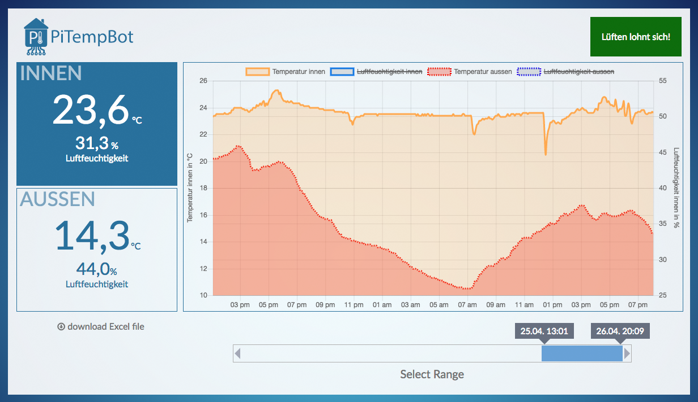

# piTempBotFrontend
This is a little self written frontend for the piTempBot temperature logger (you can find it here: https://github.com/lud-hu/piTempBot ).
It parses the recorded temperature data from the csv file into a chart and makes it discoverable with a slider for selecting the date and options to display or hide different metrics.

## Usage

You just need a temperaturlog.csv file with the recorded data in the root directory.
To use this Frontend on a Raspberry Pi (as I do it) you can install an Apache Webserver on it in then access the page via your webbrowser.

## Libraries
http://www.chartjs.org/
https://www.papaparse.com/
http://ghusse.github.io/jQRangeSlider/
